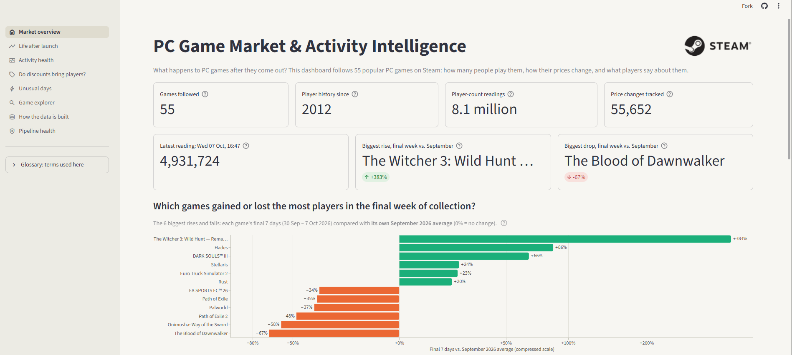
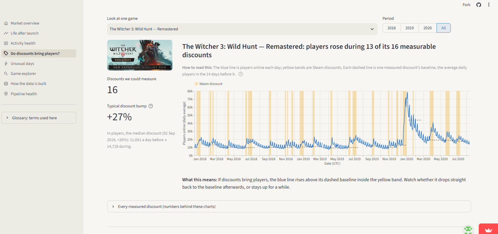
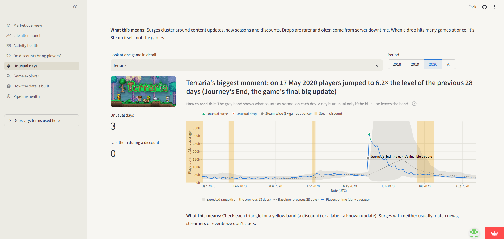
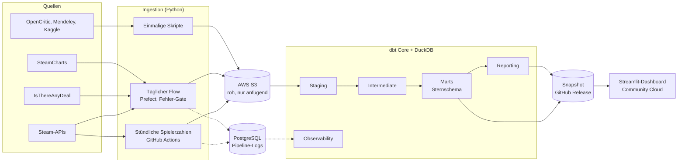

# PC Game Market & Activity Intelligence

[English](README.md) | **Deutsch**

[](https://game-market-intelligence.streamlit.app)
[](https://github.com/Aakash-1107/Game-Market-Intelligence/releases/tag/data-2026-10-07)


Eine Batch-Datenpipeline, die Spielerzahlen, Preise, Rabatte, Spieldetails und Bewertungen für 55 PC-Spiele auf Steam
aus acht Quellen sammelt. Jede Rohantwort bleibt in AWS S3 erhalten, dbt modelliert die Daten zu einem getesteten
Sternschema, die Pipeline überwacht ihren eigenen Zustand, und ein Dashboard zeigt die Ergebnisse.

**[Dashboard öffnen](https://game-market-intelligence.streamlit.app)**: ohne Installation, ohne Konto.



> Das Dashboard und die gesamte Dokumentation unter `docs/` sind auf Englisch. Diese Datei fasst das Projekt auf
> Deutsch zusammen.

## Status

Abgeschlossen. Die Datenerhebung lief vom 13. September 2026, 16:29 UTC, bis zum 7. Oktober 2026, 14:47 UTC, und ist
jetzt eingefroren. Die Endergebnisse liegen als schreibgeschützte, 17 MB große Datenbank vor
([Release `data-2026-10-07`](https://github.com/Aakash-1107/Game-Market-Intelligence/releases/tag/data-2026-10-07)),
die das gehostete Dashboard liest. Der Code läuft weiterhin von Anfang bis Ende, wenn jemand eigene Daten sammeln will.

Entstanden als Abschlussprojekt einer Weiterbildung zum Data Engineering. Der Schwerpunkt liegt auf der technischen
Umsetzung; das Dashboard zeigt, dass die Pipeline nutzbare Daten liefert.

## Was die Pipeline leistet

- **Sammelt aus acht Quellen:** drei Steam-Endpunkte (aktuelle Spielerzahlen, Spieldetails, Bewertungen),
  IsThereAnyDeal (Preisverlauf), SteamCharts (monatliche Spielerzahlen), OpenCritic (Kritikerbewertungen) und zwei
  veröffentlichte Datensätze (Mendeley: Spielerzahlen im 5-Minuten-Takt 2017–2020; Kaggle: zur Validierung).
- **Hält Rohdaten unveränderlich:** Jede Antwort landet nur anfügend in AWS S3, aufgeteilt nach Quelle und UTC-Datum.
  Jedes Modell lässt sich aus S3 neu aufbauen, ohne eine Quelle erneut abzufragen.
- **Beachtet die Grenzen der Quellen:** getaktete Anfragen, Wiederholungen mit Wartezeit, Behandlung von HTTP 429,
  eine `robots.txt`-Prüfung vor dem Scraping und Fehlerisolation pro Spiel, sodass ein fehlerhaftes Spiel nie einen
  ganzen Lauf stoppt.
- **Modelliert mit dbt auf DuckDB:** Staging → Intermediate → Marts (Sternschema) → Reporting, dazu eine
  Observability-Schicht. DuckDB liest die S3-Dateien direkt.
- **Testet jeden Build:** 192 Datentests (Eindeutigkeit, Not-null, Beziehungen, erlaubte Werte, Wertebereiche).
  Das Staging dedupliziert jede Quelle über ihren natürlichen Schlüssel, deshalb sind Wiederholungsläufe idempotent.
- **Stoppt fehlerhafte Builds:** Der tägliche Flow startet `dbt build` nur, wenn alle Ingestion-Tasks erfolgreich waren
  und die neueste stündliche Datei aktuell ist. Modelle entstehen also nie auf halb aktualisierten Quellen.
- **Überwacht sich selbst:** Protokolle pro Anfrage, pro Stufe und pro Modell in PostgreSQL speisen Health-Modelle, die
  pro Quelle zeigen, ob sie gesund ist und wo ein Fehler auftrat.
- **Skaliert über Konfiguration:** Ein neues Spiel ist eine Zeile in `tracked_games.csv`.

## Gefundene und behobene Probleme

- **13 % doppelte Bewertungen:** Die neuen Deduplizierungstests deckten 7.034 doppelte Bewertungen auf. Ursache:
  Steam wiederholt Bewertungen auf mehreren Seiten innerhalb eines Abrufs.
- **Stilles Drosseln:** Steam beantwortet manchmal ratenbegrenzte Bewertungsanfragen mit `200 OK` und einer leeren Seite.
  Das Skript wiederholt jetzt leere Seiten und protokolliert einen Fehler statt „0 Bewertungen“.
- **Ein Rechenkontingent:** Der stündliche Collector lief auf einem Prefect-Managed-Pool, bis das kostenlose
  Rechenkontingent am 5. Oktober 2026 aufgebraucht war. Am nächsten Tag zog er zu GitHub Actions um; die Lücke und ihre
  Ursache sind dokumentiert.
- **Ein Test mit frischem Clone:** Ein Klon in einen leeren Ordner, bei dem nur die Dokumentation befolgt wurde, zeigte
  fünf Lücken in der Einrichtung (leere Umgebungsvariablen, eine fehlende Abhängigkeit, ein fehlendes `dbt deps`, ein
  abweichender Datenbankpfad, ein fehlender Ordner). Alle sind behoben.

Alle Vorfälle mit Datum und Auswirkung: [docs/TRD.md, Abschnitt 13.1](docs/TRD.md#131-collection-incidents).

## Was die Daten zeigen

Die Ergebnisse sind beschreibend: was zusammen auftrat, nicht was was verursachte.

| Frage | Ergebnis |
|---|---|
| **Leben nach dem Start:** Wie halten Spiele ihre Spieler? | Das typische Spiel hält drei Monate nach dem Start 47 % seiner Spielerzahl am Launch-Höhepunkt und ab Monat 4 etwa 43 % (43 Spiele). |
| **Aktivitätszustand:** stabil oder rückläufig? | Von Oktober 2025 bis September 2026 waren 33 von 48 Spielen stabil, 10 schwankend, 3 wachsend und 2 rückläufig. |
| **Rabatte:** Bleiben die Spieler? | Während eines Rabatts hatte das typische Spiel 16 % mehr Spieler als in den zwei Wochen davor und zwei bis vier Wochen nach Rabattende noch 6 % mehr (174 Rabatte, 23 Spiele). |
| **Ungewöhnliche Tage:** Was treibt Ausschläge? | Anstiege waren an Tagen mit mindestens 50 % Rabatt etwa 13-mal so häufig wie an Tagen ohne Rabatt (29 Spiele). |





Definitionen, Vergleichswerte und vollständige Ergebnisse: [docs/ANALYTICS.md](docs/ANALYTICS.md).

## Architektur



Ein Batch-Design: Die Fragen brauchen stündliche bis tägliche Auflösung, daher ist keine Streaming-Komponente nötig.
Weitere Diagramme und die Technologieentscheidungen: [docs/TRD.md](docs/TRD.md).

## Technologie-Stack

| Bereich | Technologie |
|---|---|
| Ingestion | Python 3.11 (`requests`, `pandas`, `pyarrow`, `boto3`) |
| Rohdatenspeicher | AWS S3 |
| Transformation und Tests | dbt Core, `dbt-duckdb`, `dbt_utils` |
| Analytische Datenbank | DuckDB |
| Orchestrierung | Prefect (täglicher Flow), GitHub Actions (stündlicher Collector) |
| Pipeline-Logs | PostgreSQL (Neon) |
| Dashboard | Streamlit, gehostet auf Streamlit Community Cloud |

## Ausprobieren

| Sie möchten … | Vorgehen |
|---|---|
| Die Ergebnisse ansehen | Das [Dashboard](https://game-market-intelligence.streamlit.app) öffnen. |
| Das Dashboard lokal starten | Repository klonen, `pip install -r dashboard/requirements.txt`, `streamlit run dashboard/home.py`. Der Snapshot wird automatisch geladen. |
| Die Daten mit SQL abfragen | Den [Snapshot](https://github.com/Aakash-1107/Game-Market-Intelligence/releases/tag/data-2026-10-07) herunterladen und mit DuckDB öffnen. |
| Die ganze Pipeline ausführen | [docs/RUNBOOK.md](docs/RUNBOOK.md) folgen: Ein eigener AWS-Bucket und ein IsThereAnyDeal-Schlüssel genügen. |

## Struktur des Repositories

```text
.
├── src/ingestion/                 # ein Skript pro Quelle, ID-Auflösung, Backfill
├── flows/daily_market_refresh.py  # täglicher Flow: Ingestion, Fehler-Gate, dbt build
├── .github/workflows/             # stündlicher Spielerzahlen-Collector (seit dem Einfrieren manuell)
├── game_market/                   # dbt-Projekt: Modelle, Seeds, Tests, profiles.yml
├── dashboard/                     # Streamlit-App
├── src/utils/build_snapshot.py    # baut den öffentlichen Snapshot
├── sql/ddl/                       # Log-Tabellen in PostgreSQL
└── docs/                          # Anforderungen, Design, Analysen, Runbook, Testnachweise
```

## Dokumentation

Einstieg über [docs/README.md](docs/README.md) (auf Englisch): Lesereihenfolge und ein Zuhause pro Thema.

## Daten und Lizenz

Data powered by Steam; nicht mit Valve verbunden und nicht von Valve unterstützt. Preise von
[IsThereAnyDeal](https://isthereanydeal.com); monatliche Spielerzahlen von [SteamCharts](https://steamcharts.com);
5-Minuten-Verlauf aus dem Mendeley-Datensatz
([doi:10.17632/ycy3sy3vj2.1](https://doi.org/10.17632/ycy3sy3vj2.1), CC BY 4.0), nur als Aggregate veröffentlicht.
Quellen, Lizenzen und Inhalt des Snapshots: [docs/DATA_SOURCES.md](docs/DATA_SOURCES.md).

Der Code steht unter der [PolyForm Noncommercial License 1.0.0](LICENSE): frei für private, schulische und andere
nicht kommerzielle Nutzung. Für kommerzielle Nutzung ist eine Genehmigung nötig; Kontakt über GitHub.
