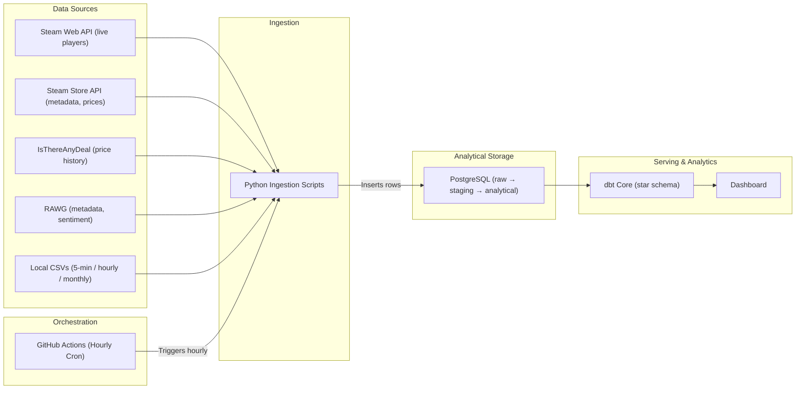

# Game Market Intelligence & Player Activity

Data Engineering capstone project that ingests, transforms, and analyses PC gaming market data. It combines player activity, pricing/discount history, and critic + player sentiment across ~50 tracked Steam games to answer four primary questions about how games acquire, retain, and lose players — and whether pricing events produce lasting behavioural change.

## 📌 Project Overview

- **~50 tracked games** — 30 with 5-minute granularity historical player data, plus ~20 newer titles tracked for live collection.
- **Four primary questions (Q1–Q4):** player lifecycle curves, sale-effect analysis, player-base health classification, and automated detection of unusual activity linked to market events.
- **Three-layer warehouse (raw → staging → analytical):** API responses kept as JSONB in the raw layer for reprocessing without re-calling APIs.
- **Hourly live ingestion** of concurrent player counts via GitHub Actions.
- **dbt Core** transforms staging into an analytical star schema with lineage and tests.

## 🏗️ Architecture



## 🛠️ Tech Stack

* **Language:** Python 3.11+
* **Data Sources:** Steam Web + Store APIs, IsThereAnyDeal (ITAD) v2, RAWG, OpenCritic (pending empirical test), SteamCharts (scrape), local CSV datasets
* **Database:** PostgreSQL (Neon for prototyping; host TBD)
* **Transformation:** dbt Core
* **Orchestration:** GitHub Actions (hourly); Apache Airflow evaluated
* **Libraries:** `requests`, `psycopg2-binary`, `pandas`, `beautifulsoup4`, `python-dotenv`

## 📂 Repository Structure

```text
├── .github/workflows/          # GitHub Actions hourly ingestion workflow
├── First_data_ingest/
│   └── steam_data_ingest.py    # Live player count ingestion script
├── TRD_Game_Market_Intelligence_v1.md   # Technical Requirements Document
├── BRD_Game_Market_Intelligence_v1.md   # Business Requirements Document
├── .gitignore                  # Git exclusion rules
├── README.md                   # Project overview and setup instructions
└── requirements.txt            # Python dependencies
```

## 🚀 Getting Started

### 1. Prerequisites
* Python 3.11+
* Git installed

### 2. Installation
Clone the repository and set up a virtual environment:

```bash
git clone https://github.com/<your-username>/<your-repo-name>.git
cd "Capstone Project"

# Create and activate virtual environment
python -m venv .venv
# On Windows PowerShell:
.venv\Scripts\Activate.ps1
# On macOS/Linux:
source .venv/bin/activate

# Install dependencies
pip install -r requirements.txt
```

### 3. Environment Variables
Create a `.env` file in the root directory (this file is excluded from git):

```ini
DATABASE_URL=postgresql://<user>:<password>@<host>/<database>?sslmode=require
RAWG_API_KEY=your_rawg_api_key_here
ITAD_API_KEY=your_itad_api_key_here
```

## 📈 Status

- [x] API feasibility testing (Steam, ITAD, RAWG; OpenCritic pending)
- [x] Hourly live player ingestion via GitHub Actions
- [x] 30-game 5-minute historical CSV bootstrap; ~20 newer games added to live tracking
- [ ] ITAD historical price backfill
- [ ] SteamCharts monthly gap-fill (2018–present)
- [ ] dbt staging → analytical star schema with tests
- [ ] Q1–Q4 analytical queries, anomaly detection, sale-effect analysis
- [ ] Dashboard