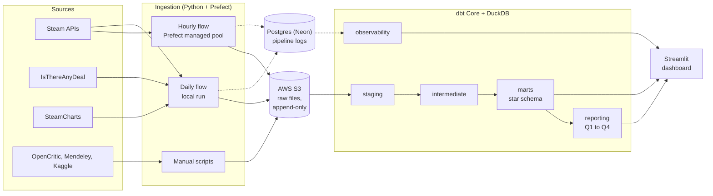

# PC Game Market & Activity Intelligence


An end-to-end **batch data engineering pipeline** for the PC game market. It collects player counts, prices,
discounts, game details and reviews for 55 Steam games from several public sources, stores every raw response,
transforms the data into a tested star schema, monitors its own health, and answers four analytical questions in an
interactive dashboard.

Capstone project of a Data Engineering programme (Weiterbildung). Formerly titled *Game Market Intelligence & Player
Activity*. The focus is the engineering: ingestion, storage, modelling, data quality, orchestration and
reproducibility. The dashboard demonstrates that the pipeline produces reusable analytical data.

## Overview

**The problem**

- Steam publishes no history of current player counts, so the history has to be collected, hour by hour.
- Player activity, price history, monthly player history and reviews sit in different places with different
  identifiers. Relating a game's players to its age or its discounts first needs collecting, aligning and cleaning
  them.

**What the pipeline does**

- **Collects** data from eight sources: three Steam endpoints, IsThereAnyDeal (prices), SteamCharts (monthly players),
  OpenCritic (critic reviews), and the Mendeley and Kaggle datasets (history).
- **Collects on a schedule:** current player counts every hour on a Prefect managed work pool; prices, game details,
  reviews and monthly players once a day in a second flow.
- **Preserves raw data:** every response is written to AWS S3, append-only and partitioned by source and UTC date, so
  every model can be rebuilt without calling a source again.
- **Handles source limits:** paced requests, retries with back-off, HTTP 429 handling, a `robots.txt` check before
  scraping, and per-game error isolation so one failing game never stops the batch.
- **Transforms with dbt on DuckDB:** staging (bronze), intermediate (silver), marts (gold, star schema) and reporting
  layers, with DuckDB reading the S3 files directly.
- **Guarantees data quality:** uniqueness, not-null, referential-integrity, accepted-value and range tests run in
  every `dbt build`. Staging deduplicates every source on its natural key, so reruns are idempotent.
- **Blocks bad builds:** `dbt build` runs only if every upstream ingestion task succeeded, so models are never built
  on a half-refreshed source.
- **Monitors itself:** per-request, per-stage and per-dbt-node logs in Postgres feed health models that report, for
  each data source, whether it is healthy now and where it failed.
- **Scales by configuration:** adding a game takes one row in `tracked_games.csv`; no code changes.
- **Serves a dashboard** of 8 pages (market overview, one page per question, game explorer, data page, pipeline
  health) that reads only the analytical tables.

**What it answers**

| # | Question |
|---|---|
| Q1 | **Life after launch:** how do games gain, lose, retain and recover players after release? |
| Q2 | **Activity health:** can a stable game be told apart from a declining one at a similar player count? |
| Q3 | **Discounts:** do players stay above their pre-discount level after a discount ends? |
| Q4 | **Unusual days:** which days show abnormal activity, and do they coincide with discounts or Steam-wide events? |

Findings are descriptive: they show what coincided with what, not what caused what. Selected results (build of
2026-09-29):

- The median game holds about 47% of its launch-peak players three months after launch (42 games).
- During a discount the median game had about 16% more players than before it, and about 6% more two to four weeks
  after (174 discounts, 23 games).
- Surges were about 13 times as frequent on days with a discount of 50% or more as on days without one. One game with
  many major updates during sales supplies a large share of those days.

Scope and coverage: [BRD](BRD_Game_Market_Intelligence_v2.md). Metric definitions:
[docs/ANALYTICS.md](docs/ANALYTICS.md).

## Architecture


```mermaid
flowchart LR
    subgraph SRC ["Sources"]
        S1["Steam APIs"]
        S2["IsThereAnyDeal"]
        S3["SteamCharts"]
        S4["OpenCritic, Mendeley, Kaggle"]
    end
    subgraph ING ["Ingestion (Python + Prefect)"]
        H["Hourly flow<br/>Prefect managed pool"]
        D["Daily flow<br/>local run"]
        M["Manual scripts"]
    end
    RAW[("AWS S3<br/>raw files,<br/>append-only")]
    LOG[("Postgres (Neon)<br/>pipeline logs")]
    subgraph DBT ["dbt Core + DuckDB"]
        ST["staging"] --> IN["intermediate"] --> MA["marts<br/>star schema"] --> RP["reporting<br/>Q1 to Q4"]
        OB["observability"]
    end
    DASH["Streamlit<br/>dashboard"]

    S1 --> H
    S1 --> D
    S2 --> D
    S3 --> D
    S4 --> M
    H --> RAW
    D --> RAW
    M --> RAW
    H -.-> LOG
    D -.-> LOG
    RAW --> ST
    LOG -.-> OB
    MA --> DASH
    RP --> DASH
    OB --> DASH
```

It is a batch design: the questions need hourly to daily resolution, so no streaming component is used. More diagrams
(data flow, runtime view, lineage, star schema, flows, observability) and the technology decisions:
[TRD](TRD_Game_Market_Intelligence_v2.md).

## Tech stack

| Area | Technology | Used for |
|---|---|---|
| Language | Python 3.11+ | Ingestion scripts and flows (`requests`, `pandas`, `pyarrow`, `boto3`) |
| Raw storage | AWS S3 | Append-only raw files, partitioned `source/YYYY/MM/DD` |
| Transformation and tests | dbt Core, `dbt-duckdb`, `dbt_utils` | Layered SQL models, data tests, lineage, exposures |
| Analytical database | DuckDB | One local file; reads the S3 files directly |
| Log database | PostgreSQL (Neon) | Ingestion, stage and dbt-result logs |
| Orchestration | Prefect | Hourly schedule on a managed pool, daily flow with a failure gate |
| Dashboard | Streamlit | Read-only analytical dashboard |
| Configuration | `python-dotenv`, `.env` | All credentials and settings come from environment variables |

## Get started

Follow [RUNBOOK.md, Part A](RUNBOOK.md#part-a-from-clone-to-your-own-analysis): prerequisites, installation, the
one-time inputs, data collection, and your first SQL queries. Daily operation and troubleshooting are in Parts B to E
of the same file.

## Repository structure

```text
.
├── First_data_ingest/steam_data_ingest.py   # hourly player-count flow (Prefect)
├── flows/daily_market_refresh.py            # daily flow: ingestion, gate, dbt build
├── prefect.yaml                             # hourly deployment (managed work pool)
├── src/
│   ├── ingestion/                           # one script per source, plus ID resolution and backfill
│   ├── observability/run_log.py             # stage and dbt result logging
│   ├── common/                              # tracked-games loader, log database connection
│   ├── utils/                               # fingerprint tool, unused-node finder, DuckDB helper
│   └── storage/                             # obsolete RustFS migration scripts
├── game_market/                             # dbt project (models, seeds, tests, profiles.yml)
├── dashboard/                               # Streamlit app (home.py + views/)
├── sql/ddl/                                 # DDL for the Postgres log tables
├── docs/                                    # PIPELINE, DATA_MODEL, ANALYTICS, tests/
├── BRD_Game_Market_Intelligence_v2.md       # business requirements
├── TRD_Game_Market_Intelligence_v2.md       # technical requirements
├── RUNBOOK.md                               # use and operation
├── .env.example                             # all environment variables
└── requirements.txt                         # dependencies of the ingestion scripts
```

## Documentation

| Document | Content |
|---|---|
| [BRD](BRD_Game_Market_Intelligence_v2.md) | Business questions, scope, requirements, coverage limits, success criteria |
| [TRD](TRD_Game_Market_Intelligence_v2.md) | Architecture, sources, storage, technical requirements, technical limitations |
| [RUNBOOK.md](RUNBOOK.md) | Step-by-step use, daily operation, troubleshooting |
| [docs/PIPELINE.md](docs/PIPELINE.md) | Flows, dbt modes, observability, health rules |
| [docs/DATA_MODEL.md](docs/DATA_MODEL.md) | Layers, models, grains |
| [docs/ANALYTICS.md](docs/ANALYTICS.md) | Metric definitions and limitations |
| [docs/tests/](docs/tests/) | Test evidence |

## License and data terms

No license has been chosen, so all rights are reserved by default. Raw data belongs to its providers and is subject to
their terms: Steam (Valve), IsThereAnyDeal, SteamCharts, OpenCritic, and the Mendeley and Kaggle dataset authors. Raw
data is not stored in this repository.
