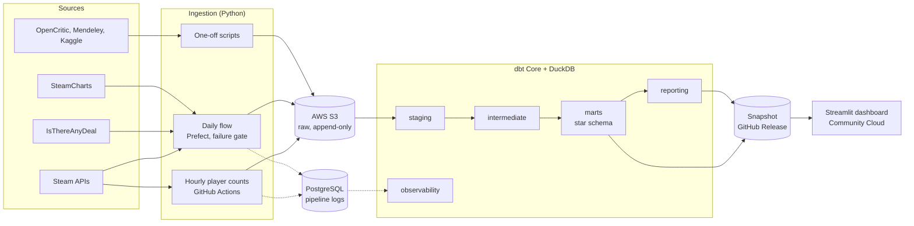

# PC Game Market & Activity Intelligence

[](https://game-market-intelligence.streamlit.app)
[](https://github.com/Aakash-1107/Game-Market-Intelligence/releases/tag/data-2026-10-07)


A batch data pipeline that collects player counts, prices, discounts, game details and reviews for 55 PC games on
Steam from eight sources, keeps every raw response in AWS S3, models the data with dbt into a tested star schema,
monitors its own health, and serves the results in a dashboard.

**[Open the dashboard](https://game-market-intelligence.streamlit.app)**: no installation, no account.


## Status

Finished. Data collection ran from 13 Sep 2026 16:29 UTC to 7 Oct 2026 14:47 UTC and is now frozen. The final results
are published as a 17 MB read-only database ([release `data-2026-10-07`](https://github.com/Aakash-1107/Game-Market-Intelligence/releases/tag/data-2026-10-07)),
which the hosted dashboard reads. The code still runs end to end for anyone who wants to collect their own data.

Built as the capstone project of a data engineering programme (Weiterbildung). The focus is the engineering; the
dashboard shows that the pipeline produces data people can use.

## What the pipeline does

- **Collects from eight sources:** three Steam endpoints (current players, game details, reviews), IsThereAnyDeal
  (price history), SteamCharts (monthly players), OpenCritic (critic reviews) and two published datasets (Mendeley,
  5-minute player history 2017–2020; Kaggle, used for validation).
- **Keeps raw data immutable:** every response lands in AWS S3, append-only and partitioned by source and UTC date.
  Every model can be rebuilt from S3 without calling a source again.
- **Respects source limits:** paced requests, retries with back-off, HTTP 429 handling, a `robots.txt` check before
  scraping, and per-game error isolation, so one failing game never stops a batch.
- **Models with dbt on DuckDB:** staging → intermediate → marts (star schema) → reporting, plus an observability layer.
  DuckDB reads the S3 files directly.
- **Tests every build:** 192 data tests (uniqueness, not-null, relationships, accepted values, ranges). Staging
  deduplicates every source on its natural key, so reruns are idempotent.
- **Blocks bad builds:** the daily flow runs `dbt build` only if every ingestion task succeeded and the newest hourly
  file is fresh, so models are never built on a half-refreshed source.
- **Monitors itself:** per-request, per-stage and per-model logs in PostgreSQL feed health models that show, per source,
  whether it is healthy and where it failed.
- **Scales by configuration:** adding a game is one row in `tracked_games.csv`.

## Problems found and fixed along the way

- **13% duplicate reviews:** the new deduplication tests caught 7,034 duplicate reviews, caused by Steam repeating
  reviews across pages within one fetch.
- **Silent throttling:** Steam sometimes answers rate-limited review requests with `200 OK` and an empty page. The
  script now retries empty pages and logs a failure instead of "0 reviews".
- **A compute quota:** the hourly collector ran on a Prefect managed pool until the free compute quota ran out on
  5 Oct 2026. It moved to GitHub Actions the next day; the gap and its cause are documented.
- **A fresh-clone test:** cloning into an empty folder and following only the docs revealed five setup gaps (empty
  environment variables, a missing dependency, a missing `dbt deps`, a database-path mismatch, a missing folder). All
  fixed.

Every incident, with dates and impact: [docs/TRD.md, section 13.1](docs/TRD.md#131-collection-incidents).

## What the data shows

Findings are descriptive: what coincided with what, not what caused what.

| Question | Result |
|---|---|
| **Life after launch:** how do games keep their players? | The typical game holds 47% of its launch-peak players three months after launch and about 43% from month 4 on (43 games). |
| **Activity health:** stable or declining? | Over Oct 2025 – Sep 2026, 33 of 48 games were stable, 10 up and down, 3 growing, 2 declining. |
| **Discounts:** do players stay? | During a discount the typical game had 16% more players than in the two weeks before, and still 6% more two to four weeks after it ended (174 discounts, 23 games). |
| **Unusual days:** what drives spikes? | Surges were about 13 times as frequent on days with a discount of 50% or more as on days without one (29 games). |


Definitions, baselines and full results: [docs/ANALYTICS.md](docs/ANALYTICS.md).

## Architecture


```mermaid
flowchart LR
    subgraph SRC ["Sources"]
        S1["Steam APIs"]
        S2["IsThereAnyDeal"]
        S3["SteamCharts"]
        S4["OpenCritic, Mendeley, Kaggle"]
    end
    subgraph ING ["Ingestion (Python)"]
        H["Hourly player counts<br/>GitHub Actions"]
        D["Daily flow<br/>Prefect, failure gate"]
        M["One-off scripts"]
    end
    RAW[("AWS S3<br/>raw, append-only")]
    LOG[("PostgreSQL<br/>pipeline logs")]
    subgraph DBT ["dbt Core + DuckDB"]
        ST["staging"] --> IN["intermediate"] --> MA["marts<br/>star schema"] --> RP["reporting"]
        OB["observability"]
    end
    SNAP[("Snapshot<br/>GitHub Release")]
    DASH["Streamlit dashboard<br/>Community Cloud"]

    S1 --> H
    S1 --> D
    S2 --> D
    S3 --> D
    S4 --> M
    H --> RAW
    D --> RAW
    M --> RAW
    H -.-> LOG
    D -.-> LOG
    RAW --> ST
    LOG -.-> OB
    MA --> SNAP
    RP --> SNAP
    SNAP --> DASH
```

A batch design: the questions need hourly to daily resolution, so no streaming component is needed. More diagrams and
the technology decisions: [docs/TRD.md](docs/TRD.md).

## Tech stack

| Area | Technology |
|---|---|
| Ingestion | Python 3.11 (`requests`, `pandas`, `pyarrow`, `boto3`) |
| Raw storage | AWS S3 |
| Transformation and tests | dbt Core, `dbt-duckdb`, `dbt_utils` |
| Analytical database | DuckDB |
| Orchestration | Prefect (daily flow), GitHub Actions (hourly collector) |
| Pipeline logs | PostgreSQL (Neon) |
| Dashboard | Streamlit, hosted on Streamlit Community Cloud |

## Try it

| You want to… | Do this |
|---|---|
| See the results | Open the [dashboard](https://game-market-intelligence.streamlit.app). |
| Run the dashboard locally | Clone the repo, `pip install -r dashboard/requirements.txt`, `streamlit run dashboard/home.py`. It downloads the snapshot by itself. |
| Query the data with SQL | Download the [snapshot](https://github.com/Aakash-1107/Game-Market-Intelligence/releases/tag/data-2026-10-07) and open it with DuckDB. |
| Run the whole pipeline | Follow [docs/RUNBOOK.md](docs/RUNBOOK.md): your own AWS bucket and an IsThereAnyDeal key are enough. |

## Repository structure

```text
.
├── src/ingestion/                 # one script per source, ID resolution, backfill
├── flows/daily_market_refresh.py  # daily flow: ingestion, failure gate, dbt build
├── .github/workflows/             # hourly player-count collector (manual since the freeze)
├── game_market/                   # dbt project: models, seeds, tests, profiles.yml
├── dashboard/                     # Streamlit app
├── src/utils/build_snapshot.py    # builds the public snapshot
├── sql/ddl/                       # log tables in PostgreSQL
└── docs/                          # requirements, design, analytics, runbook, test evidence
```

## Documentation

Start at [docs/README.md](docs/README.md): reading order and one home per topic.

## Data and license

Data powered by Steam; not affiliated with or endorsed by Valve. Prices from [IsThereAnyDeal](https://isthereanydeal.com);
monthly players from [SteamCharts](https://steamcharts.com); 5-minute history from the Mendeley dataset
([doi:10.17632/ycy3sy3vj2.1](https://doi.org/10.17632/ycy3sy3vj2.1), CC BY 4.0), published only as aggregates. Sources,
licences and what the snapshot contains: [docs/DATA_SOURCES.md](docs/DATA_SOURCES.md).

The code is licensed under the [PolyForm Noncommercial License 1.0.0](LICENSE): free for personal, educational and
other noncommercial use. Commercial use requires permission; contact me through GitHub.
