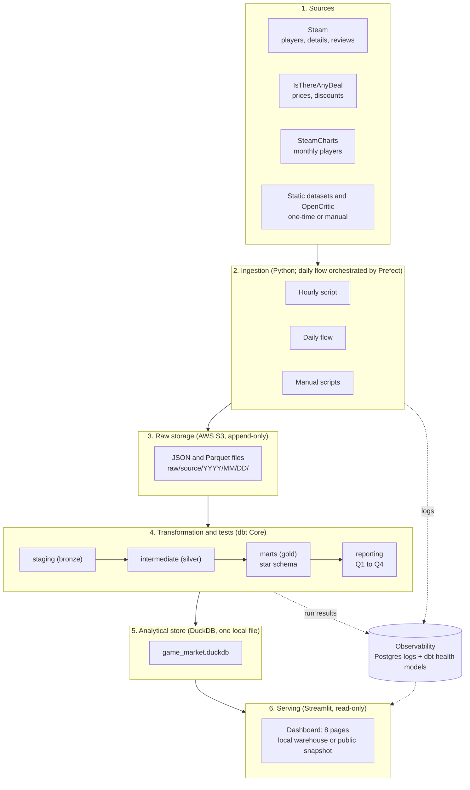
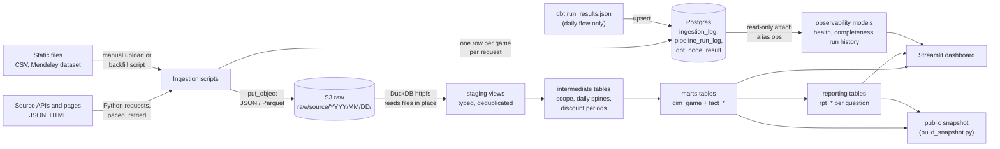
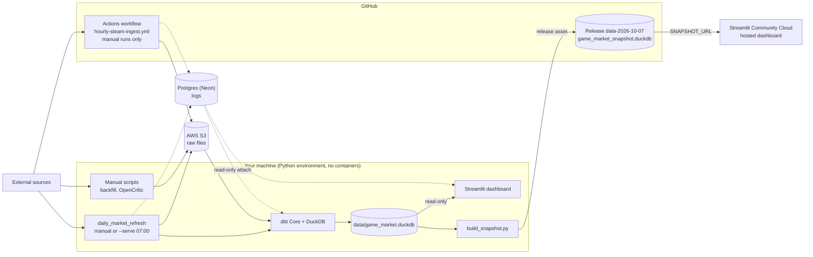
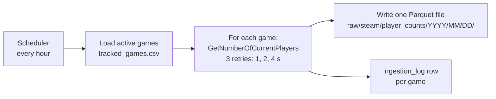
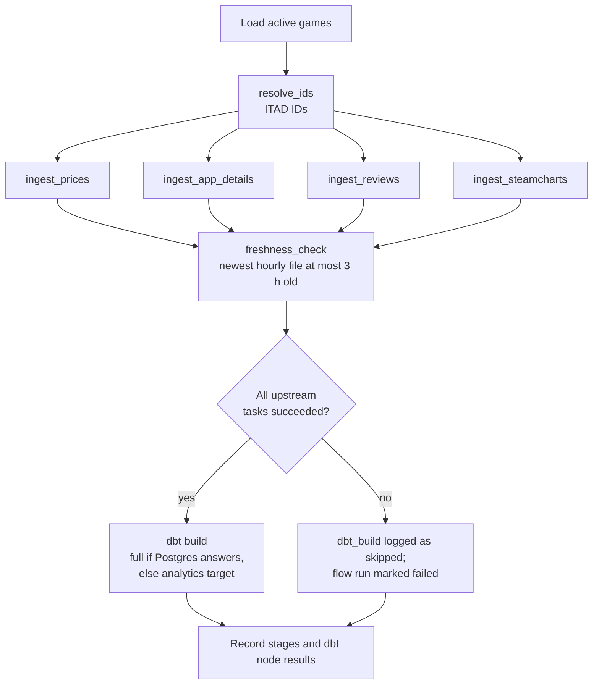
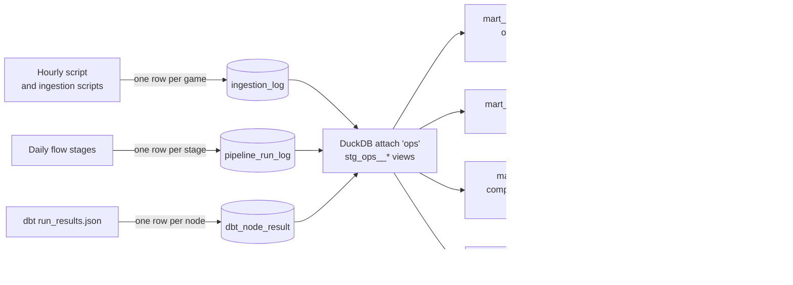

# Technical Requirements Document (TRD)

## PC Game Market & Activity Intelligence

Data collection frozen on 2026-10-07; the published snapshot and the hosted dashboard show the final state.

| | |
|---|---|
| Version | 2.1 |
| Date | 2026-10-07 |
| Author | Aakash |
| Status | Describes the implemented system; collection frozen on 2026-10-07 |
| Companion documents | [BRD](BRD.md) (what and why) |

This document states the technical requirements and how each is met. Requirements carry an ID (TR-n) and trace to the
BRD (BR-n). Implementation detail that lives in another document is linked, not repeated:

| Topic | Single home |
|---|---|
| Sources, licences, attribution, snapshot contents | [DATA_SOURCES.md](DATA_SOURCES.md) |
| Flows, dbt modes, observability tables, health thresholds | [PIPELINE.md](PIPELINE.md) |
| Layers, models, grains, layer rules, tests, rows dropped | [DATA_MODEL.md](DATA_MODEL.md) |
| Metric formulas, baselines, sample sizes, results, metric limitations | [ANALYTICS.md](ANALYTICS.md) |
| Operating procedures, queries, troubleshooting | [RUNBOOK.md](RUNBOOK.md) |
| Test evidence | [tests/](tests/) |

---

## 1. System type

A **batch** pipeline. Steam publishes the current player count, not an event stream, and the questions need hourly
to daily resolution (BRD section 3). Hourly and daily batches are sufficient; no streaming component exists.

## 2. Architecture

### 2.1 High-level architecture

Six layers, one direction of flow. Observability sits beside the pipeline and reads from it.

### 2.2 End-to-end data flow

What moves between the stages, and in which format.

### 2.3 Runtime view: where each part runs

The state after the freeze. During collection the hourly script ran on a schedule (section 13.1).

### 2.4 Components

| Component | Technology | Responsibility |
|---|---|---|
| Ingestion | Python 3.11 (`requests`, `pandas`, `pyarrow`, `boto3`) | One script per source in `src/ingestion/`, including the hourly `steam_player_counts.py` |
| Raw storage | AWS S3 | Unmodified source responses, append-only, partitioned by source and UTC date |
| Transformation and tests | dbt Core with the DuckDB adapter (`dbt-duckdb`), package `dbt_utils` | All transformations and all data tests |
| Analytical database | DuckDB, one file `data/game_market.duckdb` | Reads S3 files directly through `httpfs`; holds staging views and the tables of every other layer |
| Log database | PostgreSQL (Neon in production; any Postgres works) | Pipeline logs only: `ingestion_log`, `pipeline_run_log`, `dbt_node_result`. Attached to DuckDB read-only as alias `ops` |
| Orchestration | Prefect 3 (daily flow); GitHub Actions (hourly script) | Daily flow: schedule, task dependencies, retries, the gate in front of `dbt build`. Hourly script: a workflow with manual runs since the freeze |
| Public snapshot | DuckDB file attached to a GitHub Release | Read-only copy of the analytical tables, built by `src/utils/build_snapshot.py` ([DATA_SOURCES.md](DATA_SOURCES.md)) |
| Serving | Streamlit | Read-only dashboard on `marts`, `reporting` and `observability`; locally or hosted on Streamlit Community Cloud from the snapshot |

### 2.5 Technology decisions

| Decision | Rejected alternative | Reason |
|---|---|---|
| Raw files in S3 | Raw JSON in Postgres (JSONB), used in v1 | Files keep the source format, DuckDB queries them in place, and the raw layer needs no database to be available |
| DuckDB for analytics | Postgres | The data is read-heavy and column-oriented, one file needs no server, and DuckDB reads S3 files without a load step |
| Postgres for logs only | Logs in DuckDB | The hourly script runs on a cloud runner and cannot write a local DuckDB file; the log database is reachable from both the runner and the local machine |
| dbt for transformations | Python scripts | Versioned SQL, dependency graph, built-in tests, generated lineage |
| Prefect for the daily flow | Apache Airflow | The daily flow needs dependent tasks, per-task retries and a gate on failure. Prefect provides these without a scheduler server |
| GitHub Actions for the hourly script (from 2026-10-06) | Prefect managed work pool (used until 2026-10-05) | The Hobby plan's compute quota stopped the managed pool. The hourly script is a single step with its own retries and needs no orchestration features |
| Daily flow runs locally | Daily flow on a cloud runner | `dbt build` writes a local DuckDB file |
| Public snapshot for the hosted dashboard | Hosted dashboard on the live warehouse | The warehouse needs S3 and log-database credentials; the snapshot is one read-only file that needs none |
| No containers | Docker Compose | Everything runs from a Python environment; DuckDB is embedded, so no service has to be started |
| No streaming or distributed engine | Kafka, Spark | The questions need no sub-hourly freshness and the data fits one local DuckDB file; batch on one machine is sufficient |

## 3. Source specification

Pacing and retry values are the constants in the scripts. Terms and licences: [DATA_SOURCES.md](DATA_SOURCES.md).

| Source | Endpoint | Auth | Script | Cadence | Pacing and retries |
|---|---|---|---|---|---|
| Steam current players | `api.steampowered.com/ISteamUserStats/GetNumberOfCurrentPlayers/v1/` | none | `steam_player_counts.py` | hourly | 3 retries with 1, 2 and 4 s delay |
| Steam app details | `store.steampowered.com/api/appdetails` | none | `steam_app_details.py` | daily | 1.5 s between games |
| Steam reviews | `store.steampowered.com/appreviews/{app_id}` | none | `steam_reviews.py` | daily | 100 reviews per page, at most 1,000 per game, 1.5 s between pages and games; HTTP 429 waits 60 s (or the server's value) and retries up to 5 times |
| IsThereAnyDeal ID lookup | `api.isthereanydeal.com/games/lookup/v1` | API key | `resolve_ids.py` | daily | 0.3 s between games |
| IsThereAnyDeal price history | `api.isthereanydeal.com/games/history/v2`; country `DE`; since `2010-01-01T00:00:00Z` | API key | `itad_price_history.py` | daily | Per-game isolation |
| SteamCharts | `steamcharts.com/app/{app_id}` (HTML) | none | `steamcharts_monthly.py` | daily | 3.0 s between requests; 3 retries on HTTP 429, 500, 502, 504; `robots.txt` checked first; stops with exit code 2 when bot protection appears |
| OpenCritic (RapidAPI) | `opencritic-api.p.rapidapi.com` | RapidAPI key | `opencritic_reviews.py` | manual | 1.0 s between requests; quota 25 searches and 200 requests per day |
| Mendeley 5-minute dataset | File `PlayerCountHistoryPart1`, DOI 10.17632/ycy3sy3vj2.1 | none | `backfill_player_counts.py` | once per game | Local read, no network |
| Kaggle "Steam Monthly Average Players" | CSV | none | manual upload | once | n/a |
| Steam app list | CSV `appid,name` | none | manual upload | once | n/a |

Identity: the key of a game is its Steam app ID. IsThereAnyDeal and OpenCritic IDs are mapped to it by
`resolve_ids.py` (automatic) and `manual_id_overrides.csv` (manual; overrides always win). `game_key` in the models is
`md5(steam_app_id)`.

Sources evaluated and rejected: RAWG (adds nothing that Steam app details lacks), SteamDB (no automated access
without permission), Metacritic as a direct source (the score arrives in Steam app details), OpenGameStats,
`PriceHistory.zip` of the Mendeley dataset, and a paid SteamCharts wrapper.

## 4. Storage

### 4.1 Raw layout in S3

| Prefix | Written by | Content |
|---|---|---|
| `raw/steam/player_counts/YYYY/MM/DD/` | hourly script | One Parquet file per run. Readings before 2026-09-20 16:09 UTC were first stored in Postgres and are in two export files (`2026/09/18/`, `2026/09/19/`) |
| `raw/steam/player_counts/backfill/YYYY/MM/DD/` | backfill script | One Parquet file per game |
| `raw/steam/app_details/YYYY/MM/DD/` | daily flow | One JSON per game per run |
| `raw/steam/reviews/YYYY/MM/DD/` | daily flow | One JSON per game per run |
| `raw/itad/price_history/YYYY/MM/DD/` | daily flow | One JSON per game per run |
| `raw/mappings/itad/YYYY/MM/DD/` | daily flow | ID mapping snapshot per run |
| `raw/steamcharts/monthly/`, `monthly_html/` | daily flow | Extracted table and raw HTML |
| `raw/opencritic/reviews/YYYY/MM/DD/` | manual script | One JSON per game per run |
| `raw/steam/app_list/steam_app_list.csv` | one-time upload | Name fallback for the game dimension |
| `raw/kaggle/steamcharts_monthly_players/steamcharts.csv` | one-time upload | Static monthly dataset |

Dates are UTC.

### 4.2 Log tables in Postgres

| Table | One row is | DDL |
|---|---|---|
| `ingestion_log` | one request for one game in one script run | `sql/ddl/ingestion_log.sql` |
| `pipeline_run_log` | one stage of one daily flow run | `sql/ddl/observability.sql` |
| `dbt_node_result` | one dbt node of one `dbt build` of the daily flow | `sql/ddl/observability.sql` |

Columns and semantics: [PIPELINE.md](PIPELINE.md).

## 5. Ingestion requirements

| ID | Requirement | Implementation | BR |
|---|---|---|---|
| TR-1 | A failure for one game must not stop the batch | Each script catches errors per game, logs them, and continues | BR-1 to BR-6 |
| TR-2 | Rate limits are respected | Pacing and retry values in section 3 | BR-1 to BR-6 |
| TR-3 | Every request outcome is logged per game | One `ingestion_log` row per game per stage per run | BR-8 |
| TR-4 | A logging failure must not break ingestion | Missing `DATABASE_URL`, unreachable database or failed insert prints one warning and ingestion continues | BR-8 |
| TR-5 | Raw responses are never modified | Scripts only write objects (`put_object`) under date-partitioned keys; no ingestion script deletes anything | BR-7 |
| TR-6 | Reruns create no duplicate results | Raw is append-only; staging keeps the latest fetch per natural key (TR-9) | BR-7 |
| TR-7 | Scraping respects the site | SteamCharts script reads `robots.txt` and stops under bot protection | BR-3 |

## 6. Transformation requirements

### 6.1 dbt layers and lineage

Layer level. Model-level grains and the full list are in [DATA_MODEL.md](DATA_MODEL.md).

```mermaid
flowchart LR
    RAWS[("S3 raw files")]
    SEEDS["seeds<br/>tracked_games<br/>manual_id_overrides<br/>seed_steam_release_context"]

    subgraph STAGING ["staging (views, bronze)"]
        S1["stg_steam__player_counts"]
        S2["stg_steamcharts__monthly<br/>stg_kaggle__steamcharts_monthly"]
        S3["stg_itad__price_history"]
        S4["stg_steam__app_details<br/>stg_steam__app_list"]
        S5["stg_steam__reviews<br/>stg_opencritic__reviews"]
    end
    subgraph INTERMEDIATE ["intermediate (tables, silver)"]
        I0["int_tracked_games"]
        I1["int_player_activity_monthly__merged<br/>int_player_activity_daily"]
        I2["int_price_daily<br/>int_sale_episodes"]
    end
    subgraph MARTS ["marts (tables, gold)"]
        M0["dim_game"]
        M1["fact_player_activity<br/>fact_player_activity_daily<br/>fact_player_activity_monthly"]
        M2["fact_price_daily<br/>fact_discount_episode<br/>fact_price_snapshot"]
        M3["fact_reviews<br/>fact_critic_review"]
    end
    subgraph REPORTING ["reporting (tables)"]
        R1["Q1: rpt_game_lifecycle<br/>rpt_lifecycle_curve<br/>rpt_lifecycle_typical_curve"]
        R2["Q2: rpt_activity_health"]
        R3["Q3: rpt_discount_effect<br/>rpt_discount_effect_daily<br/>rpt_discount_typical<br/>rpt_discount_by_depth"]
        R4["Q4: rpt_market_anomalies"]
    end

    RAWS --> STAGING
    SEEDS --> I0
    STAGING --> INTERMEDIATE --> MARTS --> REPORTING
```

### 6.2 Star schema

One dimension, eight facts, joined on `steam_app_id`. Only key and grain-defining columns are shown.

```mermaid
erDiagram
    dim_game ||--o{ fact_player_activity : "steam_app_id"
    dim_game ||--o{ fact_player_activity_daily : "steam_app_id"
    dim_game ||--o{ fact_player_activity_monthly : "steam_app_id"
    dim_game ||--o{ fact_price_daily : "steam_app_id"
    dim_game ||--o{ fact_discount_episode : "steam_app_id"
    dim_game ||--o{ fact_price_snapshot : "steam_app_id"
    dim_game ||--o{ fact_reviews : "steam_app_id"
    dim_game ||--o{ fact_critic_review : "steam_app_id"

    dim_game {
        int steam_app_id PK
        string game_key "md5(steam_app_id)"
        string name
        date release_date
    }
    fact_player_activity {
        int steam_app_id FK
        timestamp recorded_at "one reading"
        string data_resolution "5min or hourly"
    }
    fact_player_activity_daily {
        string activity_day_key PK "md5(app_id, date)"
        int steam_app_id FK
        date activity_date "UTC day"
        bool is_complete_day
    }
    fact_player_activity_monthly {
        int steam_app_id FK
        date activity_month
        string source
    }
    fact_price_daily {
        string price_day_key PK "md5(app_id, date)"
        int steam_app_id FK
        date price_date "forward-filled"
        bool is_on_sale
    }
    fact_discount_episode {
        string sale_episode_key PK "md5(app_id, start)"
        int steam_app_id FK
        date sale_start
        date sale_end
    }
    fact_price_snapshot {
        int steam_app_id FK
        timestamp observed_at "one ITAD event"
        int shop_id
    }
    fact_reviews {
        int steam_app_id FK
        bool voted_up "one review"
    }
    fact_critic_review {
        int steam_app_id FK
        string source "one critic review"
    }
```

### 6.3 Requirements

| ID | Requirement | Implementation | BR |
|---|---|---|---|
| TR-8 | Layers have one purpose and one direction of dependency | staging (parse, type, deduplicate), intermediate (logic), marts (star schema), reporting (`rpt_*` models per question). Allowed reads per layer: [DATA_MODEL.md](DATA_MODEL.md) | BR-10 |
| TR-9 | Every staging model deduplicates to its natural key | Latest fetch wins; each key has a `unique` test | BR-7 |
| TR-10 | Every fact table has a defined grain and a key | Grains: [DATA_MODEL.md](DATA_MODEL.md). Daily keys: `md5(steam_app_id, activity_date)`, `md5(steam_app_id, price_date)`, `md5(steam_app_id, sale_start)` | BR-10 |
| TR-11 | Days are UTC days in every model | Day-level models use UTC; the dashboard labels Berlin time where it shows hourly timestamps | Q1 to Q4 |
| TR-12 | Resolutions are never mixed | `data_resolution` (`5min`, `hourly`, `monthly`) is a column; Q1 and Q2 read monthly data, Q3 and Q4 read 5-minute data | Q1 to Q4 |
| TR-13 | A missing value is not turned into zero | A missing player count is dropped with a note, not replaced | BR-8 |
| TR-14 | The tracked scope has one definition | `int_tracked_games`: seed rows that also have Steam app details; every intermediate model and `dim_game` join it | BR-9 |
| TR-15 | Adding a game needs one row | One row in `tracked_games.csv`; no code change ([test](tests/new_game_test_2026_09_28.md)) | BR-9 |
| TR-16 | Game attributes are current values | `dim_game` holds the latest app details per game. Changes of attributes over time are not kept | BR-5 |
| TR-17 | Reporting models are tables rebuilt by every `dbt build` | DuckDB has no materialized views. Staging stays as views so each build reads the current raw files | BR-7 |
| TR-18 | The DuckDB build fits on a 6 GB machine | `threads: 1`, `memory_limit` default 2 GB, spill directory `data/duckdb_tmp` | BR-11 |

## 7. Orchestration requirements

### 7.1 Pipeline flows

Hourly script:

Daily flow, with the gate in front of `dbt build`:

Each ingestion task retries its failed games once, five minutes later (TR-22).

### 7.2 Requirements

| ID | Requirement | Implementation | BR |
|---|---|---|---|
| TR-19 | Player counts are collected every hour without a local machine | Workflow `.github/workflows/hourly-steam-ingest.yml` runs `src/ingestion/steam_player_counts.py` with credentials from five GitHub Actions secrets: `DATABASE_URL`, `AWS_ACCESS_KEY`, `AWS_SECRET_KEY`, `AWS_REGION`, `AWS_BUCKET`. Since the freeze it runs only manually; during collection it ran on a schedule after a Prefect managed work pool (section 13.1) | BR-1 |
| TR-20 | Daily sources are collected in dependency order | `flows/daily_market_refresh.py`: resolve IDs, then prices, app details, reviews and SteamCharts in parallel, then a freshness check, then `dbt build` | BR-2, BR-3, BR-5, BR-6 |
| TR-21 | Models are never built on a half-refreshed source | `dbt build` runs only if every upstream task succeeded; otherwise it is logged as `skipped` and the flow run is marked failed | BR-8 |
| TR-22 | A failed task is retried once | Failed games only, five minutes later | BR-8 |
| TR-23 | The newest hourly file must be recent | Freshness check: at most `FRESHNESS_MAX_AGE_HOURS` (default 3) old | BR-8 |
| TR-24 | The daily flow works without the log database | If Postgres does not answer, it runs target `analytics` (`--exclude tag:observability`) and warns | BR-8, BR-11 |
| TR-25 | An ITAD outage is not reported as success | `resolve_ids` fails when no game resolves; a partial miss warns | BR-8 |

The one-time loads (Mendeley backfill, Kaggle and app-list uploads, OpenCritic) are manual scripts and are not part
of either flow.

## 8. Data quality and observability requirements

### 8.1 Observability flow

### 8.2 Requirements

| ID | Requirement | Implementation | BR |
|---|---|---|---|
| TR-26 | Data tests run in every build | `unique` and `not_null` on keys, `relationships` between facts and `dim_game`, `accepted_values`, value ranges (`dbt_utils`), and one singular test of the health rules (`game_market/tests/assert_pipeline_health_rules.sql`). Inventory: [DATA_MODEL.md, Tests](DATA_MODEL.md#tests) | BR-8 |
| TR-27 | Pipeline health is computed when read | `observability.mart_pipeline_health` is a view against `now()`, so a stopped pipeline turns red without a build. Thresholds: [PIPELINE.md](PIPELINE.md#health-rules-observabilitymart_pipeline_health) | BR-8 |
| TR-28 | Every daily-flow stage and dbt node result is recorded | `pipeline_run_log` and `dbt_node_result`, written as upserts on the primary key | BR-8 |
| TR-29 | Observability never breaks the pipeline | Every log write is wrapped; failure becomes a warning | BR-8 |
| TR-30 | A code change can be proven not to change existing data | `src/utils/fingerprint_models.py` compares every relation before and after | BR-8 |

Evidence: 224 nodes passed on 2026-09-29. Reports: dedup audit, idempotency test, layer refactor, observability, all
in [tests/](tests/).

## 9. Serving requirements

| ID | Requirement | Implementation | BR |
|---|---|---|---|
| TR-31 | The dashboard reads only analytical tables | Reads `reporting`, `marts` and `observability`; never `staging` or `intermediate` | BR-10 |
| TR-32 | The dashboard cannot change data | Opens the DuckDB file read-only: `DUCKDB_PATH` (resolved by `src/common/duckdb_path.py`, default `data/game_market.duckdb`); if that file does not exist, it downloads the snapshot from `SNAPSHOT_URL` once and opens it instead (`dashboard/db.py`) | BR-10 |
| TR-33 | The dashboard works without the log database | Only the Pipeline health page shows a message; on the snapshot it shows the frozen daily collection completeness | BR-10 |
| TR-34 | Dashboard pages are traceable to models | Each page is a dbt exposure in `models/exposures.yml` | BR-10 |

Pages: Overview, Lifecycle (Q1), Activity health (Q2), Sale effect (Q3), Market events (Q4), Game explorer, Data,
Pipeline health.

## 10. Configuration and security

| ID | Requirement | Implementation |
|---|---|---|
| TR-35 | No secret is committed | Secrets in `.env` (git-ignored) and GitHub Actions secrets; `.env.example` lists every variable without values; `profiles.yml` uses `env_var()` only |
| TR-36 | Settings are not hard-coded | Bucket, region, database URL, DuckDB path, memory limit, freshness window and snapshot URL are environment variables |
| TR-37 | Least privilege | The S3 credentials belong to an IAM user with access to the one bucket; dbt attaches the log database read-only |

## 11. Environment

| Item | Value |
|---|---|
| Python | 3.11 or newer |
| `requirements.txt` | `requests`, `python-dotenv`, `pandas`, `duckdb`, `boto3`, `pyarrow`, `lxml`, `psycopg2-binary`, `sqlalchemy`: the dependencies of the ingestion scripts, including the hourly workflow |
| `dashboard/requirements.txt` | The pinned dependencies of the dashboard (used by the hosted dashboard and for running it from the snapshot) |
| Installed separately | `dbt-duckdb`, `streamlit`, `prefect` |
| dbt targets | `dev` (default): everything, needs `DATABASE_URL`. `analytics`: no log database, run with `--exclude tag:observability` |
| Local hardware | Built and tested on a 5.8 GB machine |

Install and configuration steps: [RUNBOOK.md](RUNBOOK.md) Part A.

## 12. Verification

| Requirement group | Verified by |
|---|---|
| TR-5, TR-6, TR-9 | [dedup audit](tests/dedup_audit_2026_09_28.md), [idempotency test](tests/idempotency_test_2026_09_28.md) |
| TR-8, TR-10 | [layer refactor](tests/layer_refactor_2026_09_29.md) with before and after fingerprints |
| TR-15 | [new game test](tests/new_game_test_2026_09_28.md) |
| TR-20 to TR-25 | [daily flow test](tests/daily_flow_2026_09_28.md), [observability test](tests/observability_2026_09_29.md) |
| Backfill continuity | [backfill gap analysis](tests/backfill_gap_2026_09_28.md) |
| Metric definitions | [index definitions](tests/index_definitions_2026_09_29.md), [index consistency](tests/index_consistency_2026_09_29.md) |

## 13. Known technical limitations

Data limitations are in [BRD section 8](BRD.md#8-coverage-limits-of-the-answers). The Q4 baseline limitation is in
[ANALYTICS.md](ANALYTICS.md#limitations).

| # | Limitation | Consequence |
|---|---|---|
| 1 | The daily flow is not scheduled in the cloud | It runs when started by hand or with `--serve` on a machine that stays on. If nobody starts it, the daily sources show `warn` after 26 h; age alone never makes them `fail` |
| 2 | The hourly script is not logged stage by stage | Its health is inferred from `ingestion_log` and file freshness |
| 3 | Only `dbt build` runs started by the daily flow are recorded | A manual `dbt build` leaves no row in `dbt_node_result` |
| 4 | DuckDB allows one writer | The dashboard and `dbt build` cannot run at the same time |
| 5 | A first build needs three one-time inputs and at least one backfilled game | DuckDB raises an error when a file path matches no files |
| 6 | `requirements.txt` does not include dbt, Streamlit or Prefect | They are installed separately |
| 7 | Steam rate limits are shared across scripts | Two review fetches must not run in parallel |
| 8 | Review-histogram raw files from 2026-09-23 exist in S3 (`raw/steam/review_histogram/`) | They were never modelled |

### 13.1 Collection incidents

Hourly collection, from the snapshot and the GitHub Actions run history. A missed hour cannot be recovered (Steam has
no history endpoint). Daily completeness per source: `observability.mart_ingestion_daily`.

| When | What happened | Effect |
|---|---|---|
| 13–15 Sep | Ramp-up. The first reading is from 2026-09-13 18:29 Berlin (16:29 UTC; stored as 18:29, see the row on Berlin time below). Until 15 Sep 21:00 (Berlin), 19 readings came at irregular intervals of about 10 minutes to 6 hours; the first six covered 41 games, later readings 54 | Hourly readings from 15 Sep 21:00 (Berlin) onward |
| 17–19 Sep | Outage. Commit `fc973fb` (17 Sep 20:00 Berlin) removed `psycopg2-binary` from `requirements.txt`, which the managed pool installed on every run; `69ccd75` (19 Sep 13:50 Berlin) restored it | No readings from 17 Sep 20:00 to 19 Sep 14:00 (Berlin): 41 hourly runs missing |
| Before 20 Sep | Readings before 2026-09-20 16:09 UTC carry Berlin wall-clock time labelled as UTC (the code comment in `steam_player_counts.py` records the switch to UTC; the outage boundaries above match the commit times only when read as Berlin time) | These readings appear two hours later than they happened, in every model and on the dashboard; readings taken between 22:00 and 23:59 UTC fall on the next UTC day |
| 5–6 Oct | Prefect quota. The last reading from the Prefect managed pool is from 2026-10-05 17:00 (Berlin); from the 18:00 run on, the Hobby plan's compute quota stopped the runs | No readings for about 25 hours, until the first GitHub Actions run on 2026-10-06 16:27 UTC |
| 6 Oct | Off-schedule readings while moving to GitHub Actions: three manual workflow runs (16:27, 19:05, 19:26 UTC) and one reading at 16:37 UTC that has no GitHub Actions run | Readings 10 to 20 minutes apart |
| 6–7 Oct | Irregular GitHub schedule. The workflow's cron was `5 * * * *` (hourly), but GitHub started only three scheduled runs (2026-10-06 21:35, 2026-10-07 01:27 and 08:34 UTC). The final reading, 2026-10-07 14:47 UTC, came from a manual run | About four to seven hours between readings |

## 14. Document history

| Version | Date | Change |
|---|---|---|
| 1.0 | 2026-09 | Technical plan written before implementation |
| 2.0 | 2026-10-02 | Rewritten to match the implemented system. Replaced Postgres JSONB storage and GitHub Actions scheduling with S3, DuckDB and Prefect; removed RAWG, Airflow and Docker evaluations, the planned table definitions and the open decisions |
| 2.1 | 2026-10-07 | Collection frozen. Hourly script moved to GitHub Actions (section 13.1), Prefect hourly deployment removed; public snapshot and hosted dashboard added; collection incidents; corrected health ages (13 #1), dashboard path (TR-32), environment (section 11) |
